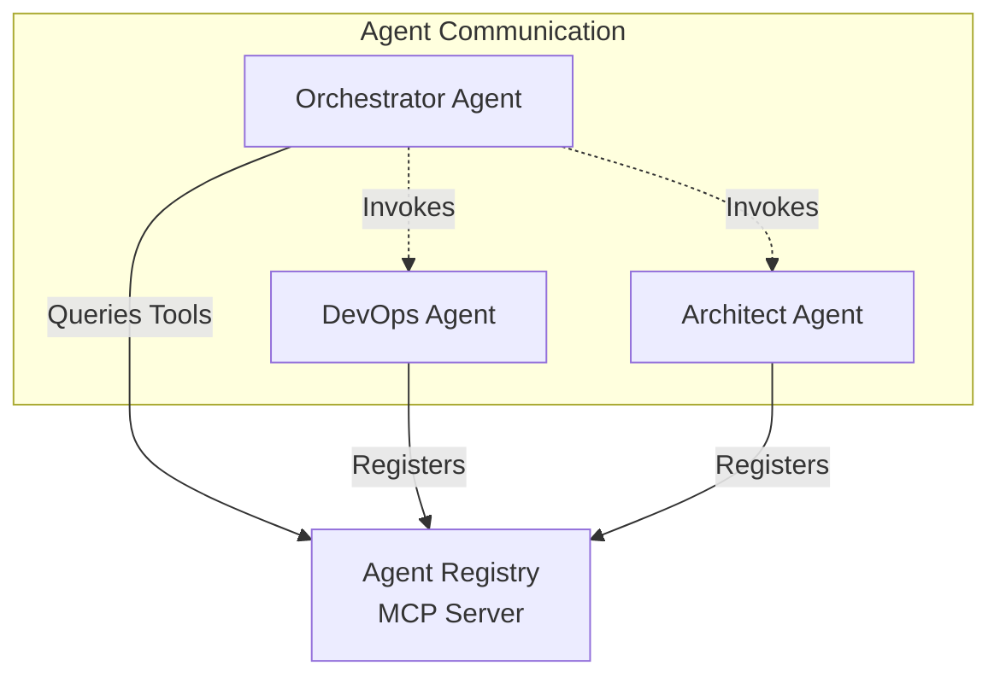

# AIBuilder

AIBuilder is a multi-agent system designed to orchestrate various AI agents for software development tasks. It utilizes the Model Context Protocol (MCP) to enable communication and tool discovery between agents.

## System Architecture

The system is built around a central **Agent Registry** that acts as a service discovery mechanism. Agents register themselves with the registry, declaring their capabilities and tools. The **Orchestrator** then uses this registry to find and invoke the appropriate agents to complete tasks.



### Key Components

1.  **Agent Registry (`agent-registry`)**
    *   An MCP server that maintains a dynamic list of active agents.
    *   Agents send heartbeats to register and keep their session alive.
    *   Exposes an MCP interface (`list_tools`, `call_tool`) allowing the Orchestrator (or other clients) to discover and use tools provided by registered agents.
    *   Proxies tool calls to the respective agent's HTTP endpoints.

2.  **AgentKit (`agentkit`)**
    *   A framework for building agents in this ecosystem.
    *   Provides the `AgentApp` class, which handles:
        *   HTTP server setup (Starlette).
        *   Automatic registration and heartbeats with the Registry.
        *   Health checks.
    *   Simplifies the creation of new agents by abstracting the communication boilerplate.

3.  **Agents**
    *   **Orchestrator (`orchestrator`)**: The main logic loop that breaks down tasks and delegates them to other agents. It holds state (SQLite) and drives the workflow.
    *   **Architect (`architect`)**: An agent specialized in software architecture tasks.
    *   **DevOps Agent (`devopsagent`)**: An agent specialized in DevOps tasks (CI/CD, environment management).

## How It Works

1.  **Startup**: When an agent starts (e.g., `devopsagent`), it initializes an `AgentApp` and begins sending heartbeats to the `Agent Registry` URL.
2.  **Registration**: The Registry records the agent's name, address, and capabilities (including MCP tools it offers).
3.  **Discovery**: The Orchestrator connects to the Registry via MCP. It requests a list of available tools.
4.  **Execution**: The Registry aggregates tools from all live agents. When the Orchestrator calls a tool (e.g., `devops_agent.deploy`), the Registry proxies this request to the actual DevOps agent's HTTP endpoint.

## Getting Started

The project uses `uv` for dependency management.

### Prerequisites

*   Python >= 3.12
*   `uv` package manager

### Installation

```bash
uv sync
```

### Running the System

You typically need to run the components in separate processes or terminals.

1.  **Start the Registry**:
    ```bash
    uv run python agent-registry/agentregistry.py
    ```

2.  **Start an Agent** (example):
    ```bash
    # Ensure env vars are set if defaults aren't sufficient
    uv run python devopsagent/devops.py
    ```

3.  **Run the Orchestrator**:
    ```bash
    uv run python orchestrator/orchestrator.py
    ```

## Project Structure

*   `agent-registry/`: The central MCP server for service discovery.
*   `agentkit/`: SDK for creating compatible agents.
*   `architect/`: Implementation of the Architect agent.
*   `devopsagent/`: Implementation of the DevOps agent.
*   `orchestrator/`: The main workflow manager.
*   `scripts/`: Utility scripts.
*   `templates/`: Project templates.
